# Spring-MVC-CRUD-Eclipse
<h2> prerequisites </h2>

<ul>
  <li>Java 11</li>
  <li>Eclipse ide Version: 2021-09 (4.21.0) </li>
  <li>Tomcat 8.5 </li>
  <li>mysql  Ver 8.0.26 for Linux on x86_64 (MySQL Community Server - GPL)

</ul>
<h2>Steps for creating Spring MVC CRUD(create, read, update, delete)</h2>

We will use Mysql as database, and Spring Data JPA

<h3>Create the database</h3>

Open a terminal and open mysql client. 

We type next command to create database as below

 create a table named person

Insert several records as example

add repositori mysql and spring-jdbc to pom file.

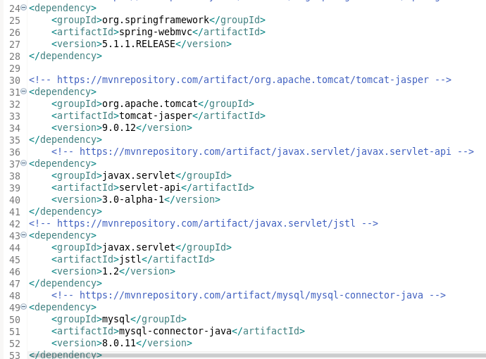

File  web.xml look as below.

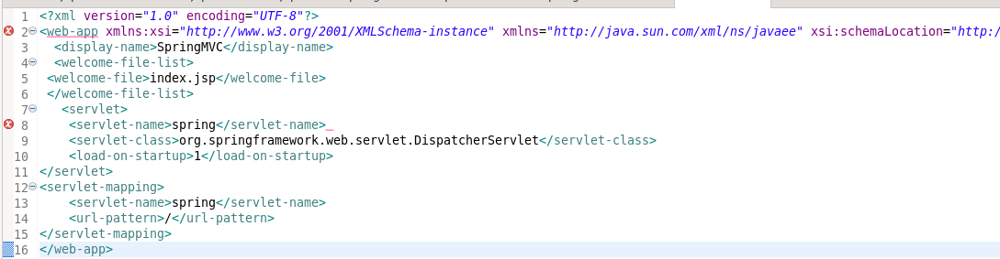

File spring-servlet.xml has a config to connect  to the database.

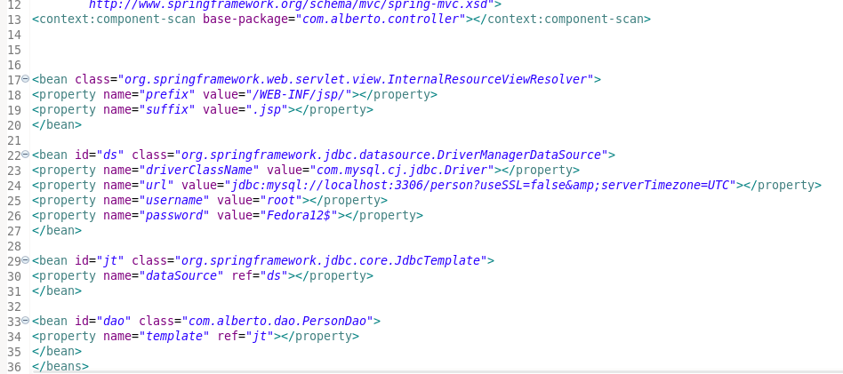

Create a package named "com.alberto.beans"

Create a bean class named "Person" 

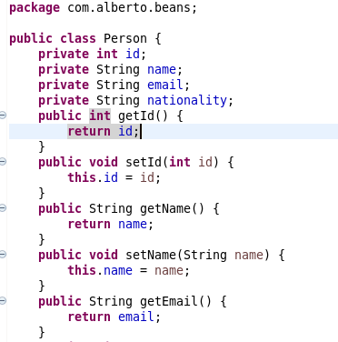

Create a package named "com.alberto.controller"

Create a bean class named "CrudController" 

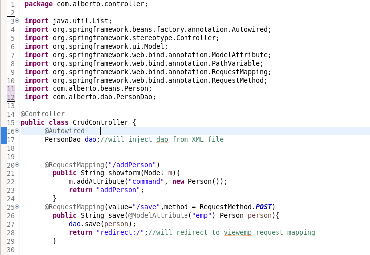

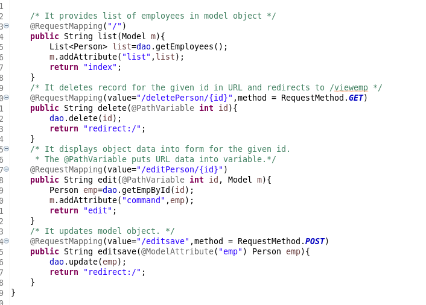

Create a package named "com.alberto.dao"

Create a bean class named "PersonDao" 

<pre>
    <code>
            package com.alberto.dao;

import java.sql.ResultSet;    
import java.sql.SQLException;    
import java.util.List;    
import org.springframework.jdbc.core.BeanPropertyRowMapper;    
import org.springframework.jdbc.core.JdbcTemplate;    
import org.springframework.jdbc.core.RowMapper;  

import com.alberto.beans.Person;   
public class PersonDao {
	JdbcTemplate template;    
    
	public void setTemplate(JdbcTemplate template) {    
	    this.template = template;    
	}     

	public int save(Person p){    
	    String sql="insert into person(name, email,nationality)  values('"+p.getName()+"','"+p.getEmail()+"','"+p.getNationality()+"')";    
	    return template.update(sql);    
	}    
	public int update(Person p){    
	    String sql="update person set name='"+p.getName()+"', email='"+p.getEmail()+"',nationality='"+p.getNationality()+"' where id="+p.getId()+"";    
	    return template.update(sql);    
	}   
	public int delete(int id){    
	    String sql="delete from person where id="+id+"";    
	    return template.update(sql);    
	} 
	public Person getEmpById(int id){    
	    String sql="select * from person where id=?";    
	    return template.queryForObject(sql, new Object[]{id},new BeanPropertyRowMapper<Person>(Person.class));    
	}    
	public List<Person> getEmployees(){    
	    return template.query("select * from person",new RowMapper<Person>(){    
	        public Person mapRow(ResultSet rs, int row) throws SQLException {    
	        	Person e=new Person();    
	            e.setId(rs.getInt(1));    
	            e.setName(rs.getString(2));    
	            e.setEmail(rs.getString(3));   
	            e.setNationality(rs.getString(4));   
	            return e;    
	        }    
	    });    
	}   
}
    </code>
</pre>

Move index.jsp to /WEB-INF folder as below

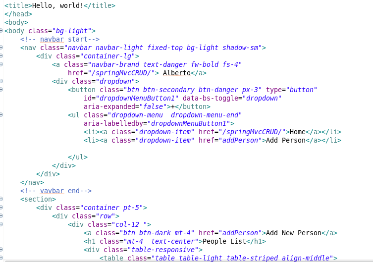

Create addPerson.jsp in /WEB-INF folder

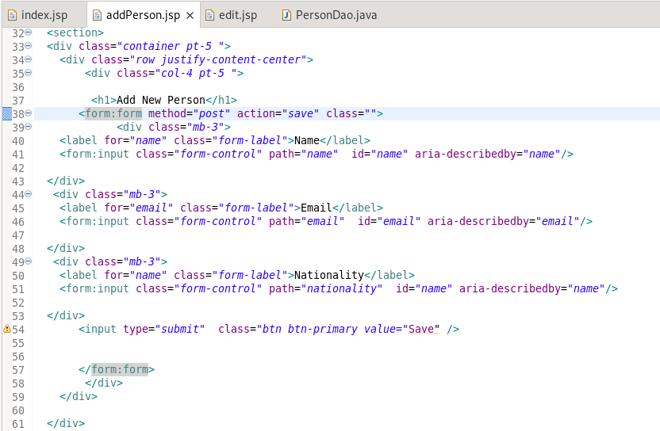

Create edit.jsp in /WEB-INF folder 

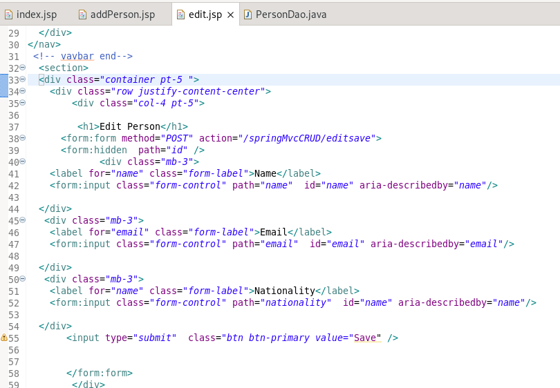

<h1>We do maven built</h1>
Right click on project -> Run as -> Maven build

Right click on project -> Rus as -> Maven build

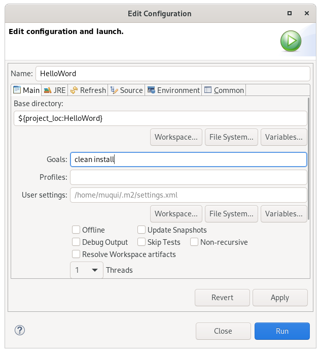
<h1>Run the application</h1>

Right click on project -> run as -> run on server

Select apache tomcat and click on finish.

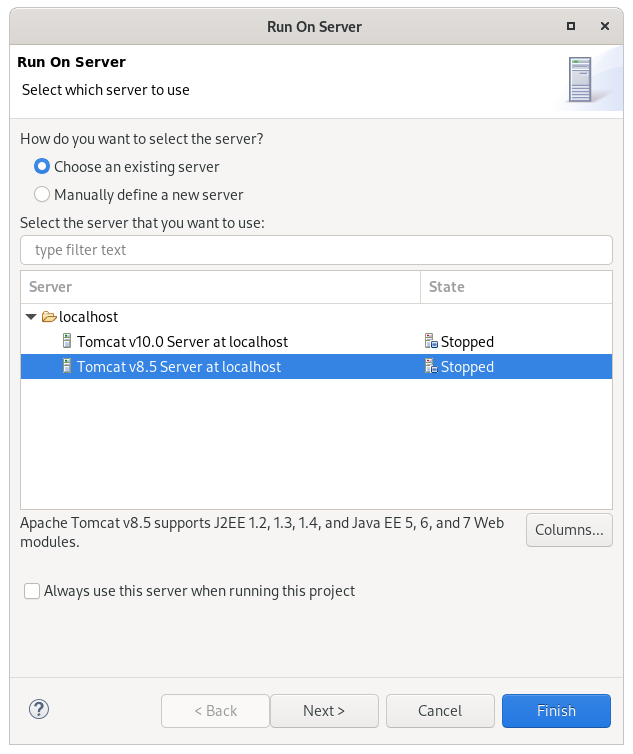

<h1>You will see below screen:</h1>

<h3>index</h3>

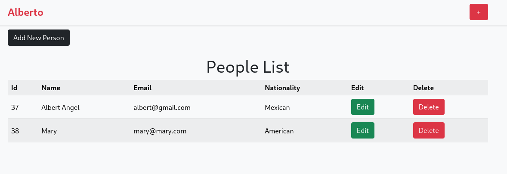
<h3>addPerson</h3>

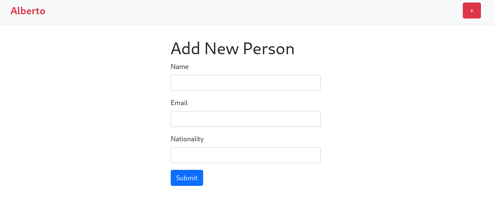

editPerson

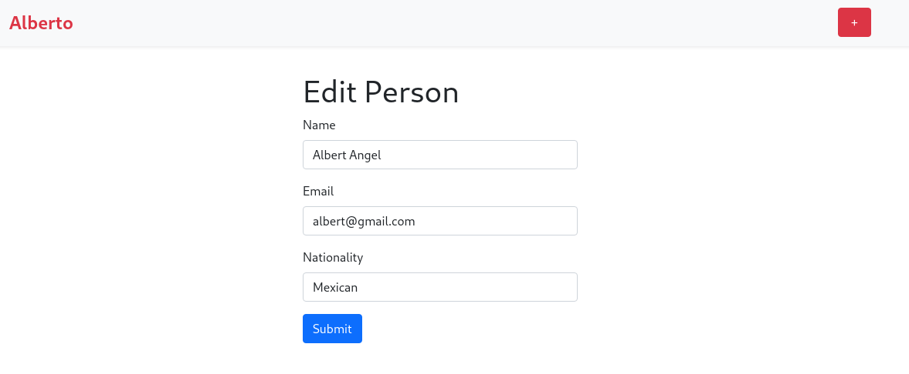

<h1>possible errors</h1>

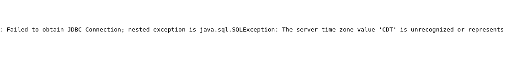

fix it 

 add "?useSSL=false&amp;serverTimezone=UTC" after name of database 

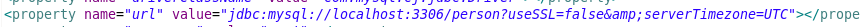

