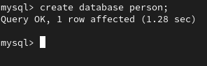
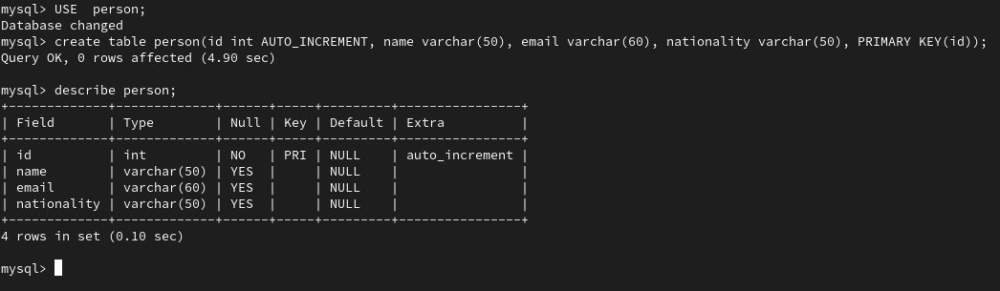
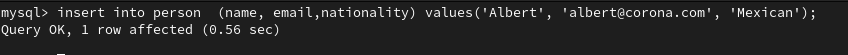
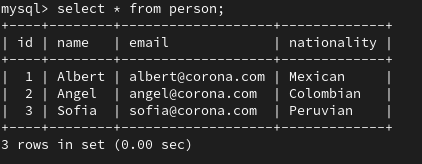

# Spring-MVC-Hello-World-Eclipse
<h2> prerequisites </h2>

<ul>
  <li>Java 11</li>
  <li>Eclipse ide Version: 2021-09 (4.21.0) </li>
  <li>Tomcat 8.5 </li>
  <li>mysql  Ver 8.0.26 for Linux on x86_64 (MySQL Community Server - GPL)

</ul>
<h2>Steps fro creating Spring MVC CRUD(create, read, update, delete)</h2>

We will use Mysql as database, and Spring Data JPA

<h3>Create the dabase</h3>

Open a terminal and open mysql client. 

We type next command to create database as below

 create a table named person

Insert several records as example

add repositori mysql and spring-jdbc to pom file.

Create java class with conexion to database

Create new controller class 

File web.xml

dispatcher server create file

 add maven depedenci javax.servlet

Create the bean class

Person Dao

